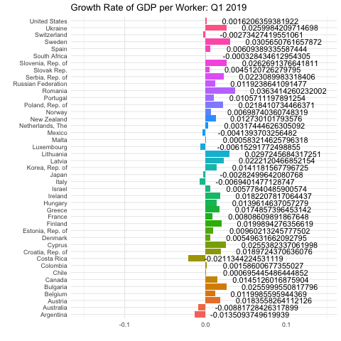

```{r, echo = T}
imf_growth <- read.csv(url('https://bcdanl.github.io/data/imf_growth_quarterly.csv'))
library(ggplot2)
library(ggthemes)
library(tidyverse)
library(plotly)
library(socviz)
library(ggiraph)
library(dplyr)
# install.packages("gganimate")
library(gganimate)

mf_growth <- imf_growth %>% 
  mutate(gy = round(gy, digits = 3))
p <- ggplot(imf_growth, aes(x= country, y= gy, fill= country))+
  geom_col()+ geom_text(aes(label=as.character(gy), hjust = -0.2))+ coord_flip()
fig_GDP <- p + transition_states(quarter, transition_length = 1, state_length =1) +
  labs(title = "Growth Rate of GDP per Worker: {closest_state}", x = "", y= "")+
  theme_minimal()+ theme(legend.position = "none")
fig_GDP

animate(fig_GDP, renderer = gifski_renderer("Byrne_hw4_q1.gif"))


```
```{r}
#question 2
climate_opinion <- read.csv(
  'https://bcdanl.github.io/data/climate_opinion_2021.csv')
install.packages("socviz")
library(socviz)
library(dplyr)
library(ggplot2)
library(tidyverse)
county_map <- county_map

climate_opinion <- climate_opinion %>% filter(belief == "human")

climate_opinion <- climate_opinion %>% mutate(id = as.numeric(id))
county_map <- county_map %>% mutate(id = as.numeric(id))

climate_opinion <- left_join(climate_opinion, county_map, by = 'id')

g <- gpplot(climate_opinion, aes(long, lat, fill = perc, group = group, text = GeoName)) +
  geom_polygon(color = "gray70", size = .05) +
  coord_equal()
g

g2 <- g + scale_fill_gradient2(
  low = "2E74C0",
  mid = "white",
  high = "#CB4541",
  na.value = "grey50",
  midpoint = 50)

```
   
